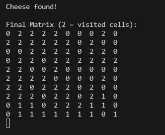

# mouse-maze-pathfinder

# Mouse Maze Pathfinder 🐭🧀

A simple Python project for finding a path in a randomly generated maze using a recursive Depth-First Search (DFS) algorithm.

Project Overview
This repository offers multiple implementations of a basic Python maze pathfinding challenge, where a 10x10 grid maze is randomly generated. The objective is to find a path for the mouse to reach the cheese starting from user-defined coordinates. The project includes three main files:

mouse-maze-pathfinder.py: The main script with visualization using matplotlib

mouse-cheese-graphic2.py: An alternative version with improved graphics and customized style

mouse-cheese.py: A pure console, minimalistic version requiring no extra libraries

Algorithm
DFS is performed recursively in eight directions from the starting cell to locate the first valid path to the goal. If no such path exists, a message will be displayed.

## How to Run

Install requirements:

```
pip install matplotlib numpy
```

Run the main version:

```
python mouse-maze-pathfinder.py
```

Run the simple console version:

```
python mouse-cheese.py
```

Run the improved graphics version:

```
python mouse-cheese-graphic2.py
```

---

## Input & Output
The user enters mouse and cheese locations (integer values 1 to 10).

If the coordinate is invalid (on a wall), an error message is shown.

The first available path is found using DFS; visited cells, open paths, and walls are marked and shown in console or graphics:

2: Visited cells

1: Free path

0: Wall

## Demo

### 1. Matrix Initialization & User Input


### 2. Console Output (path search process)




### 3. Final Visualization


---

Project Structure
maze generation: 10x10 grid with border walls (zeros)

user input: get mouse and cheese coordinates from user; validate inputs

directions: move in 8 possible directions recursively

DFS algorithm: recursively search for path from mouse to cheese

visualization: display maze and solution path using matplotlib or color styles (in advanced versions)

Files
mouse-maze-pathfinder.py: main interactive and visual version

mouse-cheese-graphic2.py: improved graphics and color-coded legend

mouse-cheese.py: pure console/terminal minimalist version

Future Improvements
Implement Breadth-First Search (BFS) for shortest path finding

Ability to load custom maze from a file

GUI implementation (e.g., using tkinter or pygame)

Unit tests for find_path function

Animated step-by-step visualization

Contribution Guide
All suggestions, bug reports, and improvement proposals are welcome!

Fork the repository

Commit your changes

Open a pull request

Please open an issue for questions or ideas
