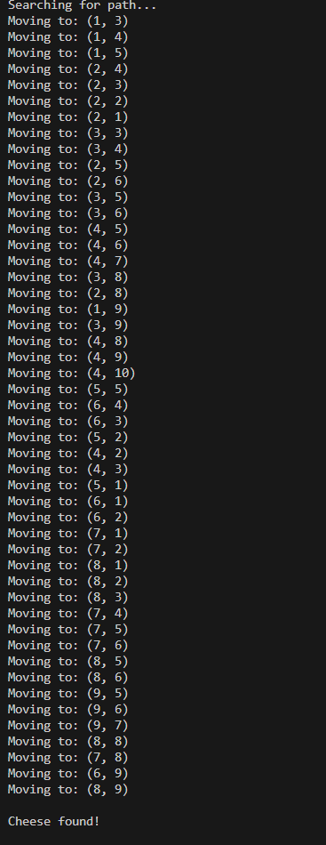
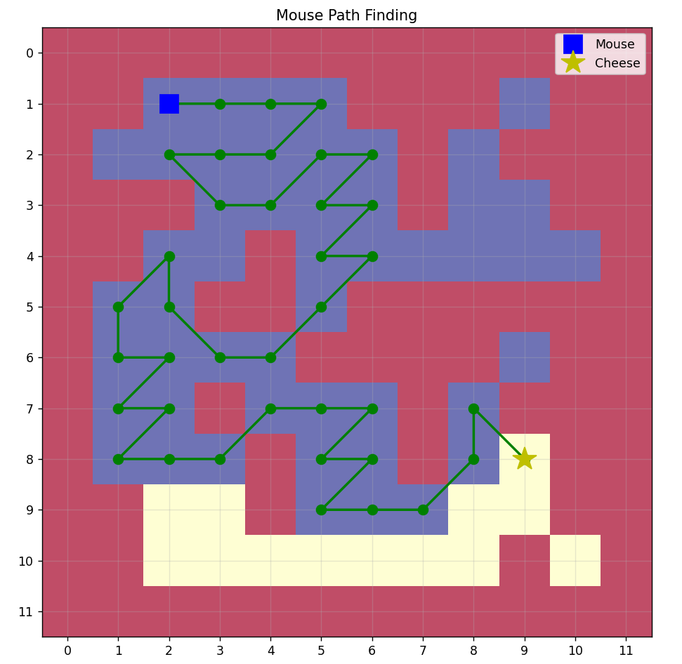

# mouse-maze-pathfinder
# Mouse Maze Pathfinder 🐭🧀

Hi!  
This is a simple Python project where I randomly generate a maze, put a mouse on one side and a piece of cheese somewhere else, and try to find a path for the mouse using Depth-First Search (DFS) — with both console and graphical output.

---

## How It Works

1. The code creates a 10x10 random matrix (0 = wall, 1 = open cell)
2. You enter mouse and cheese positions (only on 1’s!)
3. DFS tries to find if the mouse can reach the cheese
4. The console shows each move and cells visited
5. In the end, you’ll see a nice color map of the maze and the solution path

---

## How to Run

1. Make sure you have Python, and install matplotlib + numpy:

2. Run the script:

3. Just follow the prompts for mouse and cheese positions  
4. The program pops up an image of the maze, and also saves a screenshot to the `images` folder!

---

## Demo

### 1. Matrix Initialization & User Input

### 2. Console Output (path search process)

### 3. Final Visualization

---

## Notes

- Finds only *one* path (not necessarily the shortest)
- Every run gives you a new random maze!
- Output is shown in both the console and as a graphic
- Feedback or suggestions are welcome — open an issue if you want!

---

## Ideas for Future

- Add BFS for shortest path
- Step-by-step movement animation
- Custom maze import

---

Made by Mohammadreza  
Feel free to use, extend, or message me with ideas!
